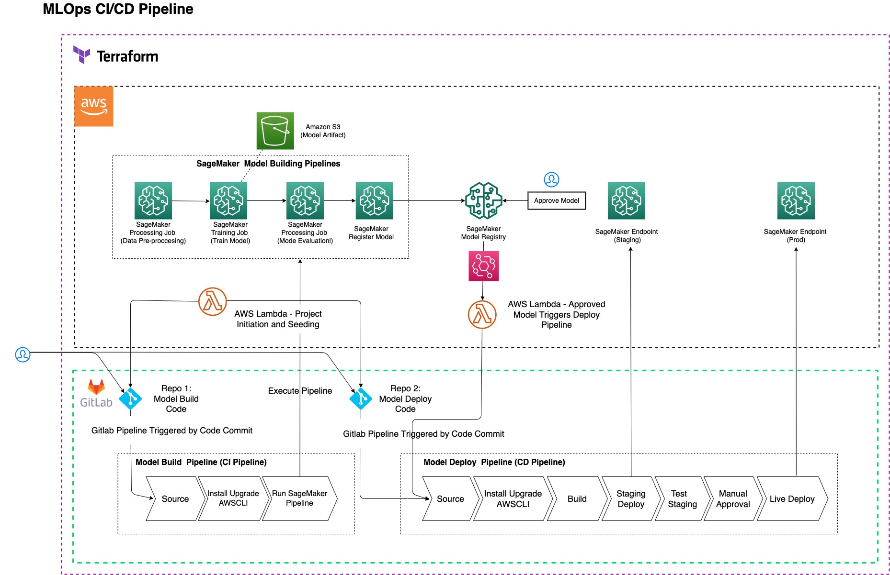

# Use Terraform and GitLab CI/CD to Build MLOps Pipeline on Amazon SageMaker

Terraform is an “infrastructure as code” tool similar to AWS CloudFormation that allows you to create, update, and version your Amazon Web Services (AWS) infrastructure. GitLab CI/CD is a tool for software development and can automatically build, test, deploy, and monitor your applications on AWS platform.

In this repository, Terraform and Gitlab CI/CD are used to deploy and orchestrate MLOps workflow on Amazon SageMaker platform. 

### Prerequisites
The following steps need to be complete before creating Gitlab projects. 
1. Create a token in GitLab that will be used by the Lambda function defined in `lambda_functions/lambda-seedcode-checkin-gitlab` to create 2 repositories in GitLab populated with seed code for model building and model deployment. 
2. Create an IAM user for GitLab. This user will be used by GitLab Pipelines when interacting with SageMaker APIs. Take note of the AWS Access Key and Secret Key. This will be used in subsequent steps.
3. [Terraform CLI installed](https://learn.hashicorp.com/tutorials/terraform/install-cli)
4. [AWS CLI installed](https://docs.aws.amazon.com/cli/latest/userguide/install-cliv2.html)

### Instruction

#### Step 1: Pass parameters
Go to `Terraform files` folder to input your own parameters (such as AWS account ID, region, Gitlab repo name, S3 bucket name. etc.) in:   
`variable.tf`

#### Step 2: Create secret and load seed files to S3
 Run `./init.sh` (You may need to run `chmod +x init.sh` first to get execution permission)
 
 It will create zip files for the seedcode and Lambda functions and upload them to S3. Pass command line arguments for the S3 bucket name, secret name, and secret token for GitLab so that the Secrets Manager key can be created. The zip files created are:  
    1. `zip_files/lambda-gitlab-pipeline-trigger.zip`  
    2. `zip_files/lambda-seedcode-checkin-gitlab.zip`  
    3. `zip_files/mlops-gitlab-project-seedcode-model-build.zip`  
    4. `zip_files/mlops-gitlab-project-seedcode-model-deploy.zip`    

#### Step 3: Run Terraform code
Go to `Terraform files`  folder,  Run the following commands in Terminal:  
`terraform init`  
`terraform apply`  

Terraform will create lambda functions, IAM service role, and CloudWatch Events.

`lambda-seedcode-checkin-gitlab` will create two repositories in Gitlab. 

Each repository will have a GitLab CI Pipeline associated with it that will run as soon as the project is created. The first run of each pipeline will fail because GitLab does not have the AWS credentials. 

For each repository, navigate to Settings -> CI/CD -> Variables.
Create 2 new variables - `AWS_ACCESS_KEY_ID` and `AWS_SECRET_ACCESS_KEY` with the associated information for your GitLab role.

Trigger the pipeline in the model build repository to start a SageMaker Pipeline execution to train your model. 

Once the SageMaker Pipeline to train the model completes, a model will be added to the SageMaker Model Registry. If that model is approved (in this repo, model is automatically approved), the GitLab Pipeline in the model deploy repository will start and the model deployment process will begin. 
A SageMaker Endpoint will be created with the suffix `-staging`. A manual step in the GitLab Pipeline is present to create an endpoint with the suffix `-production`. 

`Copyright Amazon.com, Inc. or its affiliates. All Rights Reserved. SPDX-License-Identifier: MIT-0`